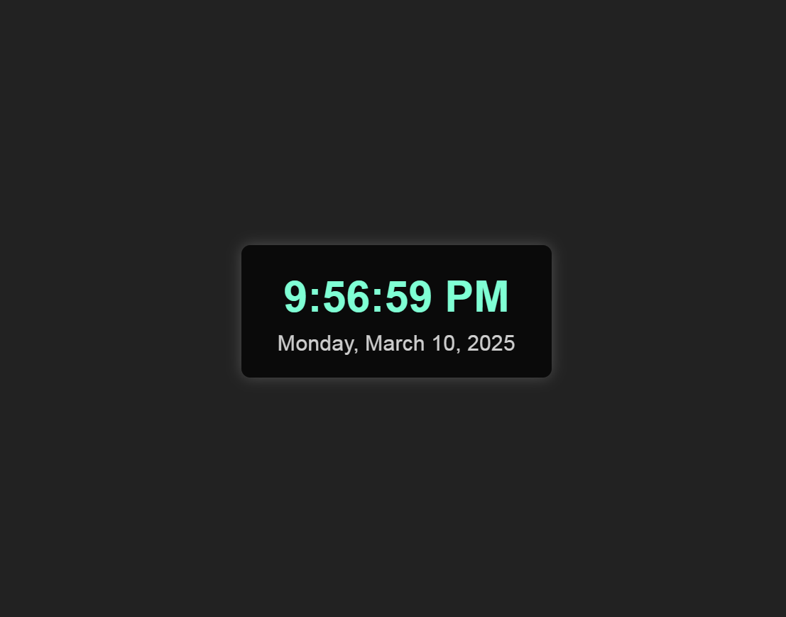


# Digital Clock

[Digital Clock](https://digittal-clock.vercel.app/)

A simple digital clock project built with HTML, CSS, and JavaScript. It displays the current time in a 12-hour format with AM/PM indication, along with the current date in a readable format.

## Features

- **Live Time Display:** Shows the current hour, minute, and second with a 12-hour clock format.
- **Date Display:** Renders the full date including the weekday, month, day, and year.
- **Responsive Design:** Centers the clock on the page for a clean and modern look.
- **Automatic Updates:** Uses JavaScript's `setInterval` to update the clock every second.

## Project Structure

```
digital-clock/
├── index.html    # Main HTML file containing the structure of the digital clock.
├── style.css     # CSS file for styling the digital clock.
└── script.js     # JavaScript file to update the clock and date.
```

## Getting Started

### Prerequisites

- A modern web browser (Chrome, Firefox, Safari, etc.)

### Installation

1. **Clone the Repository:**

   ```bash
   git clone https://github.com/yourusername/digital-clock.git
   ```

2. **Navigate to the Project Directory:**

   ```bash
   cd digital-clock
   ```

3. **Open the Project:**

   Open the `index.html` file in your preferred web browser.

## Usage

- The clock automatically updates every second.
- Modify the CSS (`style.css`) to customize the appearance.
- Update the JavaScript (`script.js`) for additional functionality or format changes.

## Customization

- **Styling:** Edit the `style.css` file to change the color scheme, fonts, or layout.
- **Functionality:** The `script.js` file can be modified to implement additional features, like toggling between 12-hour and 24-hour formats.

## Contributing

Contributions are welcome! Please fork the repository, make your changes, and submit a pull request.

## License

This project is licensed under the [MIT License](LICENSE).

---

This README provides an overview of the project, instructions for setup, and guidelines for contributions. Feel free to adjust it based on your project's specifics and your preferred workflow!
